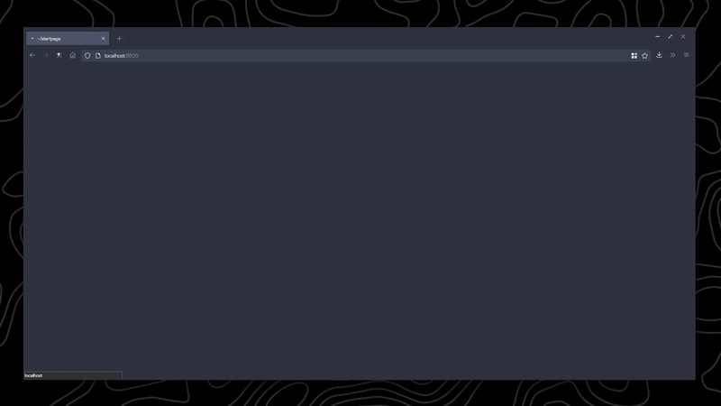

# Startpage <!-- omit in toc --> 

<!-- [Live Preview](https://kencx.github.io/startpage/) -->
## Table of Contents <!-- omit in toc --> 
- [Installation](#installation)
	- [Materials](#materials)
	- [Instructions](#instructions)
		- [Basic Setup](#basic-setup)
		- [Getting an OpenWeatherMap API Key](#getting-an-openweathermap-api-key)
		- [Changing the search engine](#changing-the-search-engine)
## Installation

### Materials
- Code editor (e.g. VSCode, Notepad++, etc.)
- Basic html/css/js knowledge (optional)
- OpenWeatherMap API Key (only if you want to use the weather feature)

### Instructions

#### Basic Setup

1. Grab the latest [release](#)
2. Unzip files and move to a convenient location (e.g. Documents)
3. Go into your browser settings (Firefox: `about:preferences`, Chrome/chromium-based: `chrome://settings/`)
4. Set the homepage to `file:///[PATH TO STARTPAGE]/index.html` (example: `file:///D:/documents/startpage/index.html`)
5. Open the homepage and check if things are working. The weather should be stuck at `loading...`. We will change that in the next step.
6. Open index.html in your code editor of choice.
   1. Find the `<section>` elements and replace the `website text`, `section header`, and `https://example.com` with your own links and text.
   2. In the `<script>` tag, replace the `[API KEY]` with your own OpenWeatherMap API key. (See next section for instructions on how to get an API key.)
   3. In the `<script>` tag, replace the `lon` and `lat` variables with your own longitude and latitude respectively.
   4. In the `<script>` tag, change the `units` variable to either `imperial` or `metric`.
7. If you want to replace the image, replace the `image.gif` file with your own image/gif of choice.
8. You should now have a working startpage!

#### Getting an OpenWeatherMap API Key
1. Go to [OpenWeatherMap](https://home.openweathermap.org/users/sign_up) and sign up.
2. Check your inbox for an email from OpenWeatherMap to verify your email address, and verify it.
3. Go to [OpenWeatherMap](https://home.openweathermap.org/api_keys). There should be an API key already generated for you. If not, generate one. The API key name does not matter.
4. You should now have an API key!

#### Changing the search engine
By default, the search engine is DuckDuckGo. You can change it to another search engine of choice by replacing the link with another below.

|Search Engine |Link  |
--- | --- |
|Google|`https://google.com/search`|
|Duckduckgo|`https://duckduckgo.com/`|
|Bing|`https://bing.com/search`|
|Ask Jeeves|`https://askjeeves.net/results.html`|

Feel free to fork and make your own changes!

- Font: Source Code Pro
- Color Scheme: Nord
- Cat Gif: [Here](https://twitter.com/avogado6/status/1165595520967954432?s=19)

